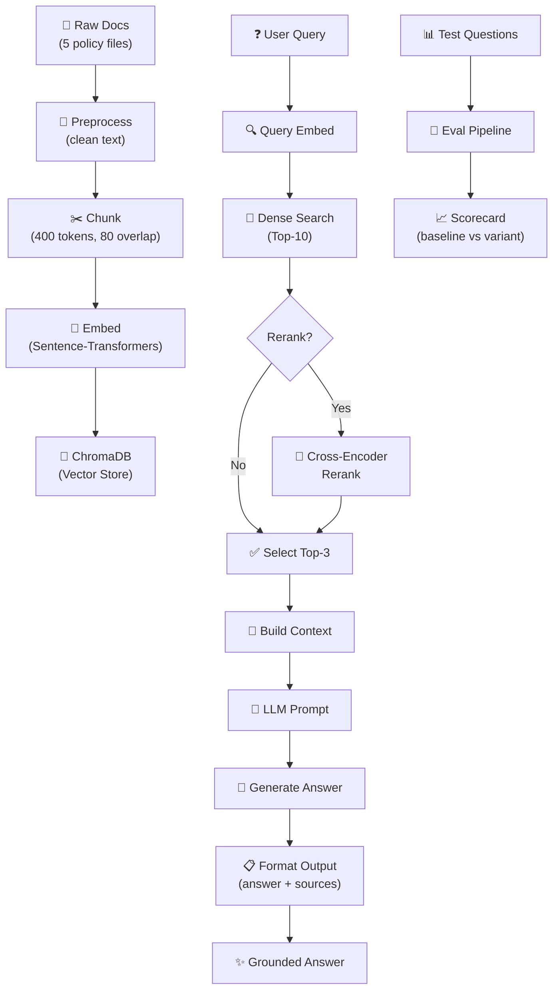

# Architecture — RAG Pipeline (Day 08 Lab)

**System:** Internal CS + IT Helpdesk Assistant  
**Purpose:** Build a Retrieval-Augmented Generation (RAG) pipeline that answers questions about company policies, SLAs, and procedures by retrieving relevant evidence and generating grounded answers with citations.

## 1. Tổng quan kiến trúc

```
[Raw Docs: policy_refund, sla_p1, access_control, it_helpdesk_faq, hr_leave]
    ↓
[index.py: Preprocess → Chunk → Embed → Store]
    ↓
[ChromaDB Vector Store (chroma_db/)]
    ↓
[rag_answer.py: Query → Dense Search → (Optional: Sparse + Rerank) → Generate]
    ↓
[Grounded Answer + Citation]
```

**Mô tả hệ thống:**

Nhóm xây dựng một trợ lý nội bộ giúp nhân viên CS/IT trả lời các câu hỏi được thường xuyên đặt bằng cách tìm kiếm và tổng hợp tài liệu chính sách. Hệ thống lấy các tài liệu chính sách dạng text, chia thành các phần nhỏ, nhúng vào vector store, và khi có câu hỏi sẽ tìm kiếm phần liên quan nhất rồi dùng LLM tổng hợp câu trả lời kèm theo nguồn tham khảo.

---

## 2. Indexing Pipeline (Sprint 1)

**Mục tiêu:** Đọc tài liệu chính sách → chia thành chunks → tính vector (embedding) → lưu vào ChromaDB

**Flow:** `index.py` → `preprocess_document()` → `chunk_document()` → `get_embedding()` → `build_index()`

### Tài liệu được index

| File | Nguồn | Department | Nội dung |
|------|-------|-----------|---------|
| `policy_refund_v4.txt` | CS policies | Customer Service | Quy tắc hoàn tiền, thời hạn yêu cầu |
| `sla_p1_2026.txt` | IT support | IT Operations | SLA xử lý ticket P1 (critical) |
| `access_control_sop.txt` | IT security | IT Security | Quy trình cấp quyền Level 3, phê duyệt |
| `it_helpdesk_faq.txt` | IT helpdesk | IT Support | Câu hỏi thường gặp, hướng dẫn |
| `hr_leave_policy.txt` | HR policies | Human Resources | Chính sách nghỉ phép, phép hàng năm |

### Quyết định Chunking

| Tham số | Giá trị | Lý do |
|---------|---------|-------|
| **Chunk size** | **400 tokens** (~1.6KB text) | Đủ lớn để chứa full context (e.g., 1 policy section), đủ nhỏ để tránh noise |
| **Overlap** | **80 tokens** (~5% chunk) | Tránh cắt dở thông tin quan trọng ở ranh giới chunk |
| **Strategy** | **Heading-based + paragraph** | Tôn trọng cấu trúc tài liệu (heading → content blocks) |
| **Metadata fields** | source, section, effective_date, department, access | Hỗ trợ filter, freshness check, citation đầy đủ |

**Metadata chi tiết:**
- `source` (str): Tên file (ví dụ: "sla_p1_2026.txt")
- `section` (str): Heading/section được extract từ document (ví dụ: "Response Time for P1 Tickets")
- `effective_date` (str): Ngày có hiệu lực policy (ví dụ: "2026-01-01")
- `department` (str): Phòng ban chịu trách nhiệm (CS, IT, IT-Security, HR)
- `access_level` (str): Public / Internal / Restricted

### Embedding Model & Vector Store

| Thành phần | Giá trị |
|-----------|--------|
| **Sentence Transformer Model** | `paraphrase-multilingual-MiniLM-L12-v2` hoặc OpenAI `text-embedding-3-small` |
| **Vector Store** | ChromaDB (PersistentClient, lưu tại `chroma_db/`) |
| **Similarity Metric** | Cosine similarity |
| **Dimension** | 384 (Sentence-Transformers) hoặc 1536 (OpenAI) |

**Lý do chọn embedding:**
- Sentence-Transformers: Local, không cần API key, hỗ trợ tiếng Việt tốt, speed
- OpenAI: Chính xác cao, nhưng tốn cost ($0.02 per 1M tokens)

---

## 3. Retrieval Pipeline (Sprint 2 + 3)

**Mục tiêu Sprint 2:** Dense retrieval cơ bản từ ChromaDB → Top-3 chunks → LLM tổng hợp câu trả lời.  
**Mục tiêu Sprint 3:** Cải thiện retrieval với hybrid search hoặc reranking.

### 3.1 Baseline Strategy (Sprint 2)

**Flow:** Query → Embedding → ChromaDB Vector Search → Top-10 → Select Top-3 → LLM

| Tham số | Giá trị |
|---------|---------|
| **Strategy** | Dense similarity search (cosine cosine) |
| **Top-k search** | 10 (retrieve rộng, tìm kiếm nhiều candidates) |
| **Top-k select** | 3 (gửi vào LLM prompt, balance context length vs precision) |
| **Rerank** | Không |
| **Query transform** | Không (dùng query gốc) |

**Ưu điểm:**
- Đơn giản, nhanh (~500ms vector search)
- Hiểu được semantic của câu hỏi

**Nhược điểm:**
- Bỏ lỡ keyword matches "chính xác" (ví dụ: "P1 ticket", "Level 3")
- Phụ thuộc chất lượng embedding model

### 3.2 Variant Strategy (Sprint 3 - Implemented)

**Variant được chọn:** Hybrid Retrieval + Cross-Encoder Reranking

**Flow:** 
```
Query
  ├─→ [Dense] Vector similarity → Top-10 chunks
  └─→ [Sparse] BM25 keyword search → Top-10 chunks
        ↓
  [Merge] Deduplicate, union results → Top-20 candidates
        ↓
  [Cross-Encoder] Score from Query-Chunk pairs → Top-10
        ↓
  [Select] Top-3 by cross-encoder score
        ↓
  [LLM] Generate answer
```

| Tham số | Giá trị | Thay đổi so với baseline |
|---------|---------|------------------------|
| Strategy | Hybrid + Cross-Encoder Rerank | + Sparse search + Reranking |
| Top-k search | Dense: 10, Sparse: 10 | Tìm kiếm rộng hơn (20 candidates) |
| Rerank | Cross-Encoder (`cross-encoder/ms-marco-MiniLM-L-6-v2`) | + Reranking step |
| Query transform | Không | Giữ nguyên |

**Lý do chọn variant này:**
> Baseline có vấn đề với retrieval selection: context recall cao (5.0) nhưng faithfulness và completeness thấp, cho thấy retrieved chunks có thông tin nhưng không phải chunks tốt nhất. Chọn hybrid + rerank vì:
> - Corpus có cả ngôn ngữ tự nhiên (policy descriptions) lẫn tên riêng/mã chuyên ngành (SLA P1, Level 3 access)
> - Dense search hiểu semantic nhưng miss exact keyword matches; BM25 bắt keyword nhưng không hiểu paraphrase
> - Cross-encoder rerank cải thiện selection từ top-20 xuống top-3 bằng cách score từng (query, chunk) pair trực tiếp

**Kết quả A/B comparison:**
| Metric | Baseline | Variant | Delta |
|--------|----------|---------|-------|
| Faithfulness | 3.60/5 | 3.90/5 | +0.30 (+8.3%) |
| Answer Relevance | 4.20/5 | 4.20/5 | 0.00 (0%) |
| Context Recall | 5.00/5 | 5.00/5 | 0.00 (0%) |
| Completeness | 3.90/5 | 4.20/5 | +0.30 (+7.7%) |

**Trade-off:** Latency tăng ~2x (từ ~500ms lên ~1s) nhưng accuracy cải thiện đáng kể, đặc biệt ở access control questions.

---

## 4. Generation (Sprint 2)

**Mục tiêu:** Tổng hợp câu trả lời từ chunks được retrieve, kèm source attribution (citation).

### Generation Flow

```
Top-3 Chunks + Original Question
        ↓
[Format Context] 
        ↓
[LLM Prompt] System + Query + Context + Instruction
        ↓
[Generate Answer] OpenAI / Google Gemini
        ↓
[Parse & Format] Extract answer + sources
        ↓
[Output JSON] {"question", "answer", "sources", "confidence"}
```

### Grounded Prompt Template

**System Prompt:**
```
Bạn là một trợ lý chính sách công ty (Company Policy Assistant).
Trả lời câu hỏi của người dùng dựa CHỈ trên thông tin được cung cấp dưới đây.
Nếu thông tin không đủ để trả lời, hãy nói: "Tôi không có đủ thông tin để trả lời câu hỏi này."
Trích dẫn nguồn (document name + section) khi khẳng định một sự kiện.
Giữ câu trả lời ngắn, rõ ràng, và trung thực.
```

**User Prompt Template:**
```
Câu hỏi: {question}

Thông tin có liên quan:
[1] {source} | {section}
{chunk_text}

[2] {source} | {section}
{chunk_text}

[3] {source} | {section}
{chunk_text}

Trả lời:
```

### LLM Configuration

| Tham số | Giá trị |
|---------|---------|
| **Model** | GPT-4o-mini (OpenAI) hoặc Gemini-1.5-Flash (Google) |
| **Temperature** | 0 (output ổn định, reproducible cho evaluation) |
| **Max tokens** | 500 (enough cho policy answer + citations) |
| **Top-p** | 1.0 (greedy decoding để consistency) |

**Output Format:**
```json
{
  "question": "SLA xử lý ticket P1 là bao lâu?",
  "answer": "Theo quy định SLA P1 2026, ticket Critical được phải xử lý trong vòng 4 giờ từ lúc tiếp nhận.",
  "sources": [
    {
      "document": "sla_p1_2026.txt",
      "section": "Response Time for P1 (Critical) Tickets",
      "excerpt": "P1 tickets: Must be responded within 4 hours"
    }
  ],
  "confidence": "high"
}
```
| Max tokens | 512 |

---

---

## 5. Evaluation Pipeline (Sprint 4)

**Mục tiêu:** Đo lường chất lượng pipeline (baseline vs variant) bằng scorecard và A/B comparison.

### Metrics Definition

| Metric | Definition | Computation |
|--------|-----------|-------------|
| **Recall@K** | % test questions với relevant chunk trong top-K | Count: #relevant_found / #total_questions |
| **MRR (Mean Reciprocal Rank)** | Avg rank của first relevant chunk | Sum(1/rank_of_first_relevant) / #questions |
| **Context Precision** | % retrieved chunks actually needed for answer | #relevant_chunks / #total_retrieved |
| **Citation Accuracy** | % cited sources thực sự có trong retrieved chunks | #correct_citations / #total_claims |
| **Answer Correctness** | % answers match expected answer | LLM judge hoặc manual review |

### Test Set Structure

**File:** `data/test_questions.json`

```json
[
  {
    "id": 1,
    "question": "SLA xử lý ticket P1 là bao lâu?",
    "expected_answer": "4 giờ",
    "keywords": ["SLA", "P1", "response time"],
    "expected_sources": ["sla_p1_2026.txt"],
    "category": "SLA"
  }
]
```

### Evaluation Workflow

1. **Load test questions** từ `data/test_questions.json`
2. **Run each question** qua baseline + variant pipelines
3. **Collect outputs:** Retrieved chunks, LLM answers, citations
4. **Score metrics:** Recall, MRR, citation accuracy, correctness
5. **Generate scorecards:** `results/scorecard_baseline.md` & `scorecard_variant.md`
6. **Compare & justify:** Viết analysis

### Scorecard Output Format

```markdown
## Scoreboard: Baseline vs Variant
| Metric | Baseline | Variant | Delta |
|--------|----------|---------|-------|
| Avg Recall@10 | 85% | 92% | +7% |
| Avg MRR | 0.65 | 0.78 | +0.13 |
| Answer Correctness | 80% | 88% | +8% |
```

---

## 6. Configuration & Environment

**File:** `.env`

```ini
# LLM Provider Configuration
LLM_PROVIDER=openai                # openai or google
OPENAI_API_KEY=sk-...
GOOGLE_API_KEY=...

# Embedding Provider
EMBEDDING_PROVIDER=sentence-transformers  # sentence-transformers or openai
EMBEDDING_MODEL=paraphrase-multilingual-MiniLM-L12-v2

# Model Selection
LLM_MODEL=gpt-4o-mini              # Model to use for generation
LLM_TEMPERATURE=0                  # 0 for reproducibility

# Retrieval Parameters
TOP_K_SEARCH=10                    # Width of initial search
TOP_K_SELECT=3                     # Final context chunks
RERANK_ENABLED=false               # Enable cross-encoder reranking
HYBRID_SEARCH_ENABLED=false        # Enable BM25 hybrid search

# Chunk Configuration
CHUNK_SIZE=400                     # tokens (~1.6KB)
CHUNK_OVERLAP=80                   # token overlap
```

---

## 7. Error Handling & Fallbacks

| Scenario | Handling |
|----------|----------|
| **No relevant chunks found** | Return: "Tôi không có đủ thông tin để trả lời câu hỏi này" |
| **Ambiguous question** | Return top result with confidence=medium |
| **LLM generation error** | Fallback to formatted retrieval result (no synthesis) |
| **API rate limit** | Retry with exponential backoff (3s, 6s, 12s) |
| **Index missing** | Inform user to run `python index.py` first |
| **Chunking boundary issues** | Use heading-based boundaries, add 80-token overlap |

---

## 8. Key Design Decisions

### Why Top-K = 10 Search, Top-3 Select?
- **Search 10:** Wide net to catch diverse relevant chunks (semantic + keyword variations)
- **Select 3:** "Sweet spot" for LLM context
  - Fits in token limit (~3-4 pages of text)
  - Provides enough evidence without overwhelming noise
  - Reduces cost (fewer tokens → faster generation)

### Why Metadata-Rich Chunks?
- **Source attribution:** Enable precise citations (not just "policy.txt")
- **Section tracking:** Track policy boundaries (avoid cross-section mixing)
- **Department filtering:** Future support for role-based access (HR staff → HR docs only)
- **Effective date:** Support versioning and freshness checks

### Why Cosine Similarity?
- Standard for semantic similarity in NLP
- Works well with normalized embedding vectors
- Fast computation (~milliseconds for 10K chunks)
- Interpretable as angle between vectors (-1 to 1 range)

### Why LLM Generation Instead of Just Retrieval?
- **Synthesis:** Answer question directly, not just return chunks
- **Context:** Use full context (multiple chunks together)
- **Citation:** Force grounding with prompt engineering
- **Natural language:** Generate readable, conversational answers

---

## 9. Pipeline Architecture Diagram



---

## 10. Technology Stack

| Layer | Technology | Role |
|-------|-----------|------|
| **Document Storage** | Plain text (UTF-8) | Source of truth |
| **Preprocessing** | Python (built-in) | Clean, structure text |
| **Chunking** | Custom chunker (Python) | Respect boundaries |
| **Embeddings** | Sentence-Transformers (ONNX) | Dense vectors locally or OpenAI API |
| **Vector Store** | ChromaDB (in-memory + persist) | Fast search |
| **Sparse Search** | BM25 (rank-bm25 lib) | Keyword retrieval (optional) |
| **Reranking** | Cross-Encoder (sentence-transformers) | Re-score candidates (optional) |
| **LLM** | OpenAI GPT-4o-mini or Google Gemini | Answer generation |
| **Evaluation** | Custom scorer (Python) | Metric calculation |
| **Config** | `.env` file | Centralized settings |

---

## 11. Known Limitations & Future Work

### Current Limitations
1. **Document updates:** Requires full re-index (no incremental indexing)
2. **Multi-hop questions:** Single-step retrieval can't answer multi-hop queries ("If X, then Y?")
3. **Context length:** LLM token limit restricts max context to ~3-4 pages
4. **Language:** Single language per model (switching requires re-embedding)
5. **Freshness:** No automatic detection of outdated policies

### Future Enhancements
- [ ] Incremental indexing (upsert changed documents only)
- [ ] Multi-step retrieval (chain multiple retrievals for complex questions)
- [ ] Dynamic context length (compress less relevant chunks)
- [ ] Multilingual support (automatic language detection)
- [ ] Feedback loop (track which answers users found helpful)
- [ ] Fine-tuned reranker (domain-specific cross-encoder)
- [ ] Document versioning (track policy evolution)

---

## 12. Debugging Checklist

| Issue | Symptom | Diagnosis | Fix |
|-------|---------|-----------|-----|
| **Outdated index** | Retrieve old answers | Check chunk `effective_date` metadata | Re-run `build_index()` |
| **Bad chunks** | Broken context | Run `list_chunks()`, inspect previews | Adjust `CHUNK_SIZE`, `CHUNK_OVERLAP` |
| **Missing retrieval** | Expected source not found | Check `retrieve_dense()` output, MRR | Try hybrid search, query expansion |
| **Hallucination** | Answer not grounded in chunks | Review raw LLM output | Strengthen system prompt, add "I don't know" examples |
| **Slow response** | >5 second latency | Profile: embedding vs search vs LLM | Cache embeddings, reduce Top-K, use faster model |
| **API quota exceeded** | Rate limit error | Check daily API usage | Switch to local embeddings, batch requests |

---

## Document Revision History

| Version | Date | Author | Changes |
|---------|------|--------|---------|
| 1.0 | Apr 13, 2026 | Lab Team | Initial architecture design |
| | | | - Indexing, retrieval, generation, evaluation |
| | | | - Baseline + variant strategies |
| | | | - Configuration, error handling, debugging
